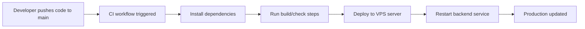

# Bluebook Renewal System - Backend

This is the backend for the Bluebook Renewal System, a comprehensive solution for managing and renewing vehicle registration (bluebooks) and related services. This README provides a detailed overview of the backend architecture, features, and API endpoints.

## Table of Contents

- [Features](#features)
- [Architecture](#architecture)
- [API Endpoints](#api-endpoints)
  - [Authentication](#authentication)
  - [Bluebook Management](#bluebook-management)
  - [Electric Bluebook Management](#electric-bluebook-management)
  - [Payment](#payment)
  - [Electric Vehicle Payment](#electric-vehicle-payment)
  - [KYC (Know Your Customer)](#kyc-know-your-customer)
  - [News Management](#news-management)
  - [Marquee Management](#marquee-management)
- [Authentication Flow](#authentication-flow)
- [Deployment](#deployment)
- [CI/CD Pipeline](#cicd-pipeline)
- [Getting Started](#getting-started)
- [Technologies Used](#technologies-used)

## Features

-   **User Authentication:** Secure user registration, login, and profile management with JWT-based authentication. Includes support for Google OAuth.
-   **Bluebook Management:** Create, manage, and renew vehicle bluebooks.
-   **Electric Bluebook Management:** Specialized management for electric vehicle bluebooks.
-   **Payment Integration:** Integrated with Khalti for seamless payment of taxes and renewal fees.
-   **KYC Verification:** A robust KYC system to verify user identities.
-   **Admin Dashboard:** A powerful admin dashboard to manage users, bluebooks, KYC requests, and news.
-   **News and Announcements:** A system for publishing news and announcements to users.
-   **Marquee/Ticker:** A simple marquee system for displaying important messages.

## Architecture

The backend is built using Node.js and Express.js, following a modular architecture. The application is divided into several modules, each responsible for a specific feature. This modular approach makes the codebase easy to understand, maintain, and scale.

The project structure is as follows:

```
Server/
├── src/
│   ├── config/
│   ├── middleware/
│   ├── modules/
│   │   ├── admin/
│   │   ├── auth/
│   │   ├── Bluebook/
│   │   ├── ElectricBluebook/
│   │   ├── ElectricPayment/
│   │   ├── kyc/
│   │   ├── marquee/
│   │   ├── news/
│   │   ├── payment/
│   │   └── user/
│   ├── services/
│   └── utils/
├── public/
└── index.js
```

## API Endpoints

### Authentication

| Method | Endpoint                        | Description                               |
| ------ | ------------------------------- | ----------------------------------------- |
| POST   | /auth/register                  | Register a new user                       |
| POST   | /auth/verify-email-otp          | Verify email OTP for registration         |
| POST   | /auth/resend-otp                | Resend verification OTP                   |
| POST   | /auth/login                     | Login a user                              |
| POST   | /auth/google                    | Authenticate with Google                  |
| POST   | /auth/google-complete-profile   | Complete profile for Google users         |
| GET    | /auth/profile                   | Get logged-in user's profile              |
| PUT    | /auth/profile                   | Update logged-in user's profile           |
| POST   | /auth/forgot-password           | Request a password reset                  |
| POST   | /auth/verify-reset-otp          | Verify OTP for password reset             |
| POST   | /auth/reset-password            | Reset user's password                     |

### Bluebook Management

| Method | Endpoint                          | Description                               |
| ------ | --------------------------------- | ----------------------------------------- |
| POST   | /bluebook                         | Create a new bluebook                     |
| GET    | /bluebook/my-bluebooks            | Get all bluebooks for the logged-in user  |
| GET    | /bluebook/:id/download            | Download a bluebook                       |
| GET    | /bluebook/admin/all               | Get all bluebooks (Admin only)            |
| GET    | /bluebook/admin/pending           | Get all pending bluebooks (Admin only)    |
| GET    | /bluebook/admin/verified          | Get all verified bluebooks (Admin only)   |
| PUT    | /bluebook/:id/verify              | Verify a bluebook (Admin only)            |
| PUT    | /bluebook/:id/reject              | Reject a bluebook (Admin only)            |
| PUT    | /bluebook/admin/:id               | Update a bluebook (Admin only)            |
| GET    | /bluebook/fetch/:id               | Fetch a bluebook by ID                    |

### Electric Bluebook Management

| Method | Endpoint                                | Description                               |
| ------ | --------------------------------------- | ----------------------------------------- |
| POST   | /electric-bluebook                      | Create a new electric bluebook            |
| GET    | /electric-bluebook/my-bluebooks         | Get all electric bluebooks for the logged-in user |
| GET    | /electric-bluebook/:id/download         | Download an electric bluebook             |
| GET    | /electric-bluebook/admin/all            | Get all electric bluebooks (Admin only)   |
| GET    | /electric-bluebook/admin/pending        | Get all pending electric bluebooks (Admin only) |
| GET    | /electric-bluebook/admin/verified       | Get all verified electric bluebooks (Admin only) |
| PUT    | /electric-bluebook/:id/verify           | Verify an electric bluebook (Admin only)  |
| PUT    | /electric-bluebook/:id/reject           | Reject an electric bluebook (Admin only)  |
| PUT    | /electric-bluebook/admin/:id            | Update an electric bluebook (Admin only)  |
| GET    | /electric-bluebook/fetch/:id            | Fetch an electric bluebook by ID          |

### Payment

| Method | Endpoint                          | Description                               |
| ------ | --------------------------------- | ----------------------------------------- |
| POST   | /payment/bluebook/:id             | Pay tax for a bluebook                    |
| POST   | /payment/verify/:id               | Verify a payment transaction              |
| POST   | /payment/verify-otp               | Verify a payment OTP                      |

### Electric Vehicle Payment

| Method | Endpoint                                  | Description                               |
| ------ | ----------------------------------------- | ----------------------------------------- |
| POST   | /electric-payment/electric-bluebook/:id   | Pay tax for an electric bluebook          |
| POST   | /electric-payment/initiate-khalti         | Initiate a Khalti payment                 |
| POST   | /electric-payment/verify/:id              | Verify an electric payment transaction    |
| POST   | /electric-payment/verify-otp              | Verify an electric payment OTP            |

### KYC (Know Your Customer)

| Method | Endpoint                                | Description                               |
| ------ | --------------------------------------- | ----------------------------------------- |
| POST   | /kyc/submit                             | Submit KYC details                        |
| PUT    | /kyc/update                             | Update KYC details                        |
| GET    | /kyc/my-kyc                             | Get logged-in user's KYC details          |
| GET    | /kyc/admin/users                        | Get all users' KYC details (Admin only)   |
| GET    | /kyc/admin/users/:userId                | Get a specific user's KYC details (Admin only) |
| POST   | /kyc/admin/users/:userId/approve        | Approve a user's KYC (Admin only)         |
| POST   | /kyc/admin/users/:userId/reject         | Reject a user's KYC (Admin only)          |

### News Management

| Method | Endpoint                          | Description                               |
| ------ | --------------------------------- | ----------------------------------------- |
| GET    | /news/public/active               | Get all active news                       |
| POST   | /news                             | Create a new news article (Admin only)    |
| GET    | /news                             | Get all news articles (Admin only)        |
| GET    | /news/:id                         | Get a news article by ID (Admin only)     |
| PUT    | /news/:id                         | Update a news article (Admin only)        |
| DELETE | /news/:id                         | Delete a news article (Admin only)        |
| PATCH  | /news/:id/status                  | Update the status of a news article (Admin only) |

### Marquee Management

| Method | Endpoint                          | Description                               |
| ------ | --------------------------------- | ----------------------------------------- |
| GET    | /marquee                          | Get the marquee text                      |
| PUT    | /marquee                          | Update the marquee text (Admin only)      |

## Authentication Flow

The following diagram illustrates the authentication flow of the application:

```mermaid
graph TD
    subgraph User Registration
        A[Start] --> B{User provides registration data};
        B --> C[Server validates data];
        C --> D{Data valid?};
        D -- Yes --> E[Create new user];
        E --> F[Send verification OTP];
        F --> G[User verifies OTP];
        G --> H[Registration complete];
        D -- No --> I[Return error];
    end

    subgraph User Login
        J[Start] --> K{User provides login credentials};
        K --> L[Server validates credentials];
        L --> M{Credentials valid?};
        M -- Yes --> N[Generate JWT token];
        N --> O[Login successful];
        M -- No --> P[Return error];
    end

    subgraph Password Reset
        Q[Start] --> R{User requests password reset};
        R --> S[Server sends reset OTP];
        S --> T[User verifies OTP];
        T --> U{OTP valid?};
        U -- Yes --> V[User sets new password];
        V --> W[Password reset successful];
        U -- No --> X[Return error];
    end

    subgraph Google Authentication
        Y[Start] --> Z{User clicks Google login button};
        Z --> AA[Redirect to Google for authentication];
        AA --> BB[Google returns user profile];
        BB --> CC{User exists in database?};
        CC -- Yes --> DD[Generate JWT token];
        DD --> EE[Login successful];
        CC -- No --> FF[Prompt user to complete profile];
        FF --> GG[User completes profile];
        GG --> HH[Create new user];
        HH --> II[Generate JWT token];
        II --> JJ[Login successful];
    end
```



## Deployment

The backend is hosted on a **VPS server** for production use.

-   The application runs as a long-running Node.js service on the VPS.
-   Production environment variables are configured securely on the server.
-   Static/public assets (uploads, images) are served from the backend `public/` directory.
-   The VPS setup is used as the live deployment target for all production updates.

## CI/CD Pipeline

This project includes a **CI/CD pipeline** that automatically deploys backend changes whenever code is pushed to the `main` branch.

### Trigger

-   Any push to `main` starts the deployment workflow.

### Pipeline Flow



### Outcome

-   Deployment is automated, consistent, and fast.
-   Production stays in sync with the latest stable code in `main`.
-   Manual deployment steps are minimized, reducing release risk.

## Getting Started

To get the backend server running locally, follow these steps:

1.  **Clone the repository:**
    ```bash
    git clone https://github.com/your-username/bluebook-renewal-system.git
    cd bluebook-renewal-system/Server
    ```

2.  **Install dependencies:**
    ```bash
    npm install
    ```

3.  **Set up environment variables:**
    Create a `.env` file in the `Server` directory and add the necessary environment variables. You can use the `env.example` file as a template.

4.  **Start the server:**
    ```bash
    npm start
    ```

The server will be running at `http://localhost:5000`.

## Technologies Used

-   **Node.js:** A JavaScript runtime built on Chrome's V8 JavaScript engine.
-   **Express.js:** A minimal and flexible Node.js web application framework.
-   **MongoDB:** A cross-platform document-oriented database program.
-   **Mongoose:** An ODM library for MongoDB and Node.js.
-   **JWT (JSON Web Tokens):** A compact, URL-safe means of representing claims to be transferred between two parties.
-   **Khalti:** A popular payment gateway in Nepal.
-   **Nodemailer:** A module for Node.js applications to allow easy as cake email sending.
-   **Multer:** A node.js middleware for handling `multipart/form-data`.
-   **Docker:** A set of platform as a service products that use OS-level virtualization to deliver software in packages called containers.
